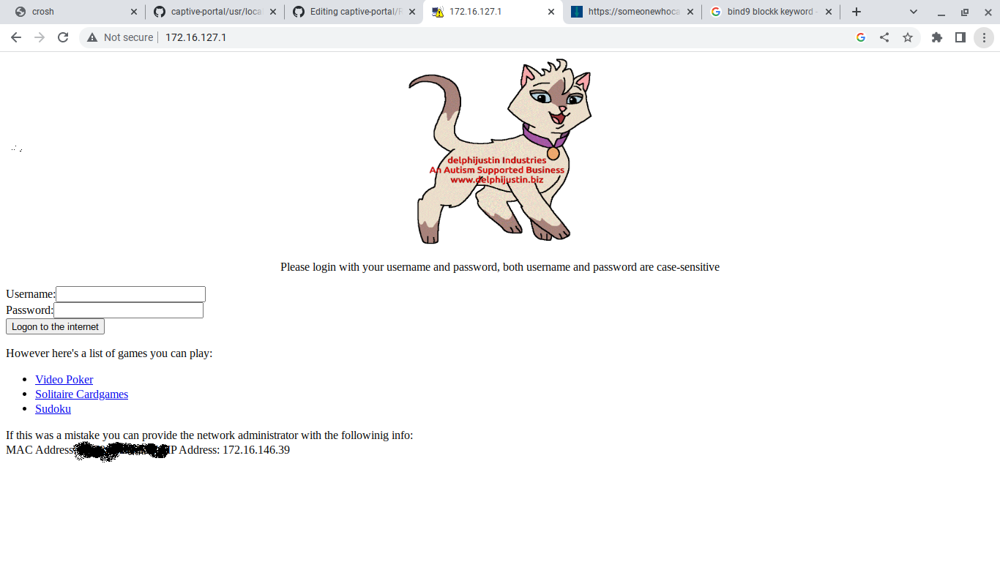

# captive-portal
Captive portal and NAT Firewall for linux

  This is a simple captive portal for linux. It may work on windows with WSL. 
  It took me 2 weeks to finish so I hope you like it. I wanted to make a better
  Wifi login system. I would like to thank ChatGPT for helping me.
   To install type sudo ./install.sh

